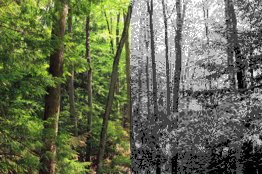
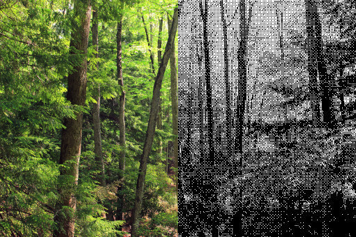

# ordered-dithering-cpp

A tool for performing black and white Bayer dithering, written in C++17.


### 2x2 Bayer Kernel



### 4x4 Bayer Kernel


### 8x8 Bayer Kernel



## Usage

```
# Use the 8x8 Bayer kernel (currently available sizes are 2x2, 4x4, and 8x8).
# Increase pre-dithering brightness by 30 (pixel intensity values range from 0-255).
# Increase pre-dithering contrast by 15%.
# For the PNG output format, a bit depth of 1 is automatically selected.
ordered_dithering_main /path/to/some_image.jpg /path/to/output.png 8 30 1.15
```

## Dependencies

There are a few dependencies required to build this tool:

#### Bundled/Fetched by CMake

-   ASIO (https://think-async.com/Asio)

-   fmt (https://github.com/fmtlib/fmt)

#### Not included

-   libvips (https://github.com/libvips/libvips)

## Building

The recommended way of building this project is as follows:

1. Grab the source code

```
git clone https://github.com/nilssonk/ordered-dithering-cpp
cd ordered-dithering-cpp
```

2. Run CMake to configure and build the project using presets and ninja-build

```
# Clang Debug build with clang-tidy static analysis enabled
cmake --preset=clang-debug .
cmake --build --preset=clang-debug
# GCC Release build with LTO enabled
cmake --preset=gcc-release-lto .
cmake --build --preset=gcc-release-lto
```

If all goes well, the executable can then be found at _main/ordered_dithering_main_ inside the build directory (default _${sourceDir}/build_).
